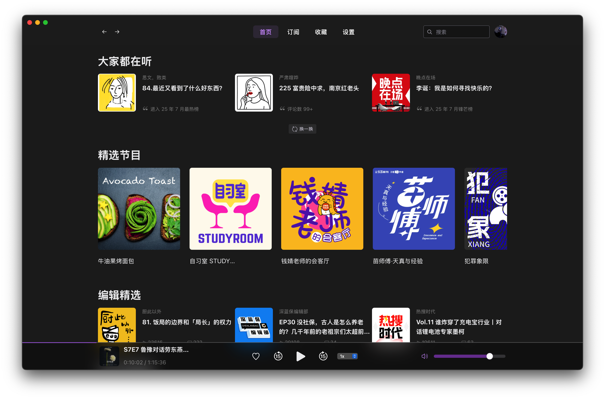
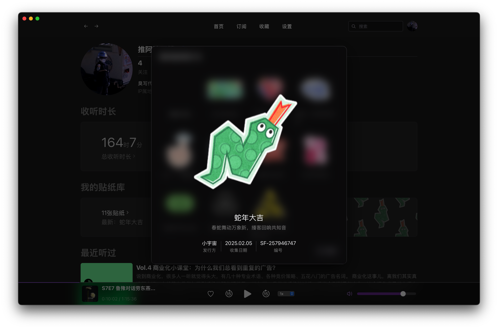
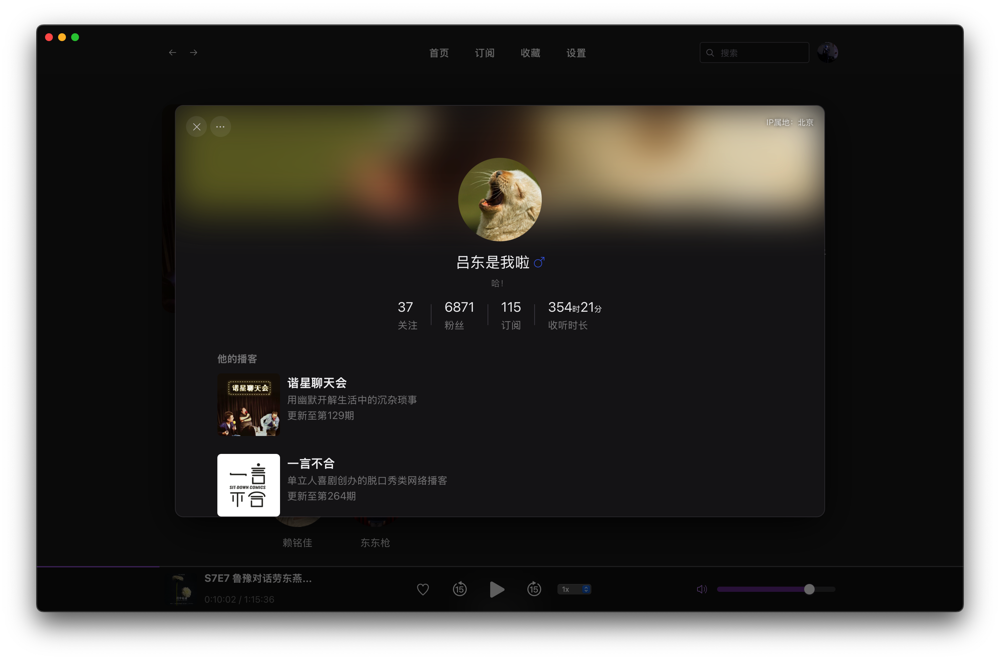
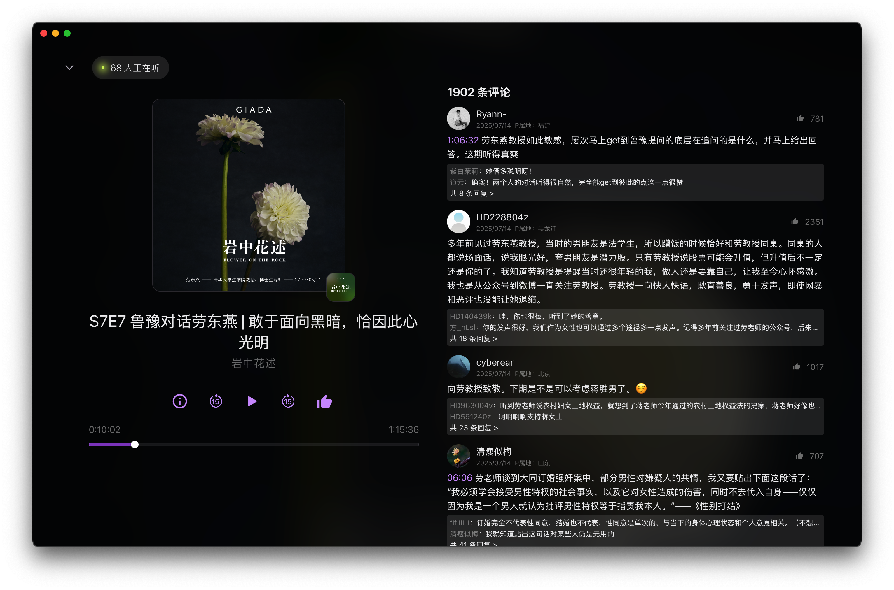

<h1 align="center">
  
  <br>horizon<br>
</h1>
<h4 align="center">第三方小宇宙桌面客户端</h4>
<p align="center">使用 <a href="https://wails.io">wails</a> + <a href="https://react.dev">react</a> 构建的第三方小宇宙桌面客户端，支持 Windows 和 MacOS</p>

## 截图

<details>

<summary>展开/收起</summary>










</details>

## 下载

前往 [Release](https://github.com/ultrazg/horizon/releases) 页面下载并解压即可使用。MacOS 平台需要将解压后的 `horizon.app` 拖入 `Application` 目录中。

## 开发

### 1.环境

- [Node.js](https://nodejs.org/)

- [pnpm](https://pnpm.io/)： `npm install -g pnpm`

- [Go](https://go.dev/)

- [wails](https://wails.io/)：`go install github.com/wailsapp/wails/v2/cmd/wails@latest`

### 2.拉取和构建

```bash
git clone https://github.com/ultrazg/horizon.git

cd horizon/frontend

pnpm install

pnpm build

cd ..

# 在开发模式下运行
wails dev

# 或者

# 构建对应平台的可执行文件
wails build
```

> 应用在启动的同时，会在 `http://localhost:23020` 启动一个 [API](https://github.com/ultrazg/xyz) 接口服务，可以通过 `http://localhost:23020/docs` 访问接口文档

## 声明

**本项目仅供个人学习使用，请尊重版权，数字内容均为小宇宙所有**

## LICENSE

[GPL-3.0](https://github.com/ultrazg/horizon/blob/dev/LICENSE)
